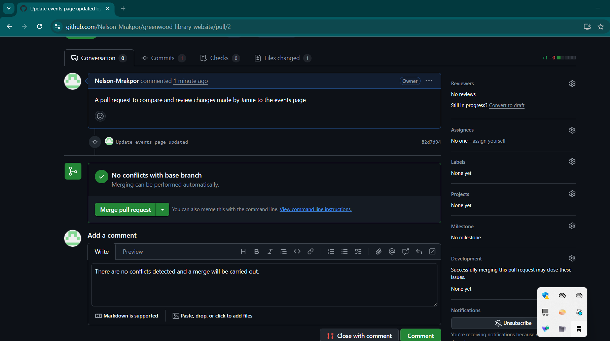

# Greenwood Library Website

A GitHub repository demonstrating collaboration between two contributors on a library website.

This project showcases **branching**, **merging**, **conflict resolution**, and **collaborative development** using Git and GitHub. It simulates two contributors:  

- **Morgan** – adds the *Book Reviews* section  
- **Jamie** – updates the *Events* page  

---

## Objectives

1. Practice cloning a repository and working with branches in Git.  
2. Gain experience in staging, committing, and pushing changes from multiple contributors.  
3. Create pull requests and merge them, resolving any potential conflicts.  

---

## 1. Setup

A repository named **`greenwood-library-website`** was created on GitHub.  

  

---

### 1.1 Cloning the Repository
The repository was cloned from GitHub using VS Code.  

  

---

### 1.2 Creating the Initial Codebase
The initial files simulating the website’s codebase were created:  

- `home.html`  
- `about_us.html`  
- `events.html`  
- `contact_us.html`  

  

---

### 1.3 Staging and Committing Initial Files
The newly created files were staged and committed, ready for pushing to the repository.  

  

---

### 1.4 Pushing Initial Files to GitHub
Once staged and committed, the files were pushed to the **`main`** branch.  

  

---

## 2. Morgan’s Contribution – Adding Book Reviews

### 2.1 Creating Morgan’s Branch
A new branch, **`add-book-reviews`**, was created for Morgan’s changes.  
A new file, `book_reviews.html`, was added to simulate the feature.  

  

---

### 2.2 Staging and Committing Changes
Morgan’s changes were staged and committed.  

  

---

### 2.3 Pushing Morgan’s Branch
The committed changes were pushed to the **`add-book-reviews`** branch.  

  

---

### 2.4 Raising a Pull Request
Once Morgan’s changes were pushed, a pull request was created.  

  

---

### 2.5 Merging into Main
Morgan’s changes were reviewed, found to have no conflicts, and merged into **`main`**.  

  

---

## 3. Jamie’s Contribution – Updating Events

### 3.1 Pulling Latest Changes
Before creating the **`update-events`** branch, the latest changes from **`main`** were pulled to ensure Morgan’s updates were included.  

  

---

### 3.2 Staging and Committing Changes
Jamie’s updates to the Events section were staged and committed.  

  

---

### 3.3 Pushing Jamie’s Branch
The changes were pushed to the **`update-events`** branch.  

  

---

### 3.4 Raising a Pull Request
A pull request was created for Jamie’s updates.  

  

---

### 3.5 Merging into Main
Jamie’s changes were reviewed, found to have no conflicts, and merged into **`main`**.  

  

---
